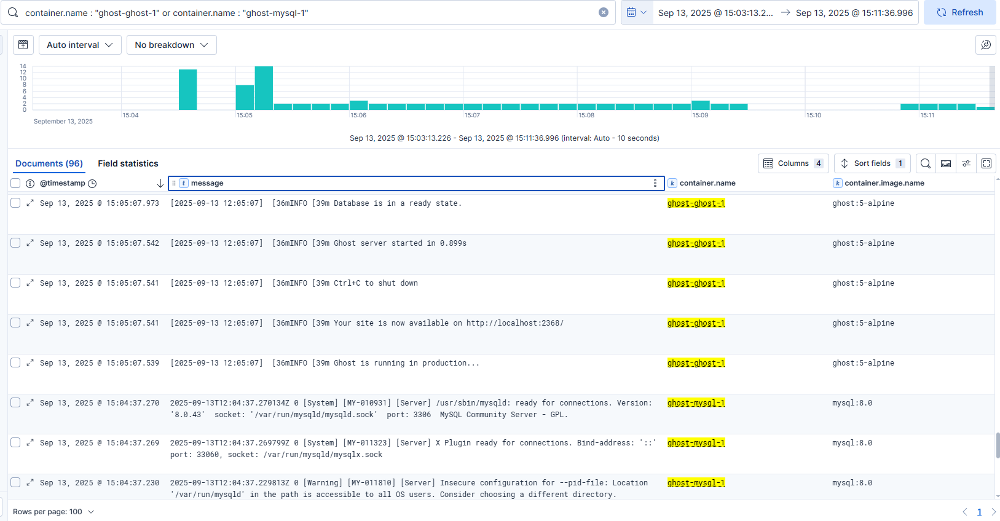
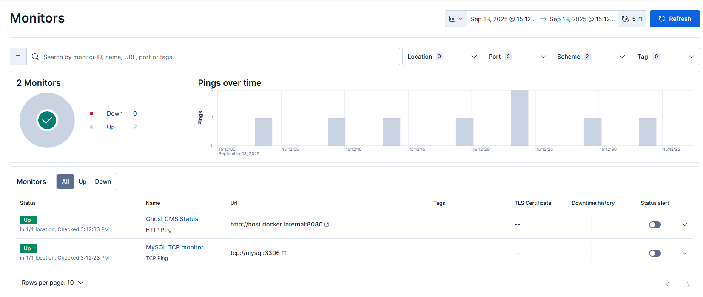
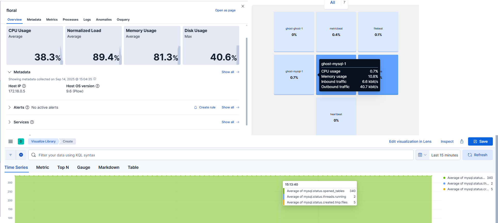

# EFK Stack

- elasticsearch
- kibana
- filebeat
- logstash
- heartbeat
- vector

Запуск Elastic Stack:
```bash
docker compose -f ../GAP-1/ghost-stack.yaml -p ghost up -d
docker exec -ti elasticsearch /usr/share/elasticsearch/bin/elasticsearch-reset-password -u kibana
docker compose up -d kibana elasticsearch logstash filebeat metricbeat heartbeat
```

Запуск с vector вместо `logstash` и `filebeat`
```bash
docker compose up -d  kibana elasticsearch vector
```

## Filebeat



## Heartbeat



## Metricbeat

