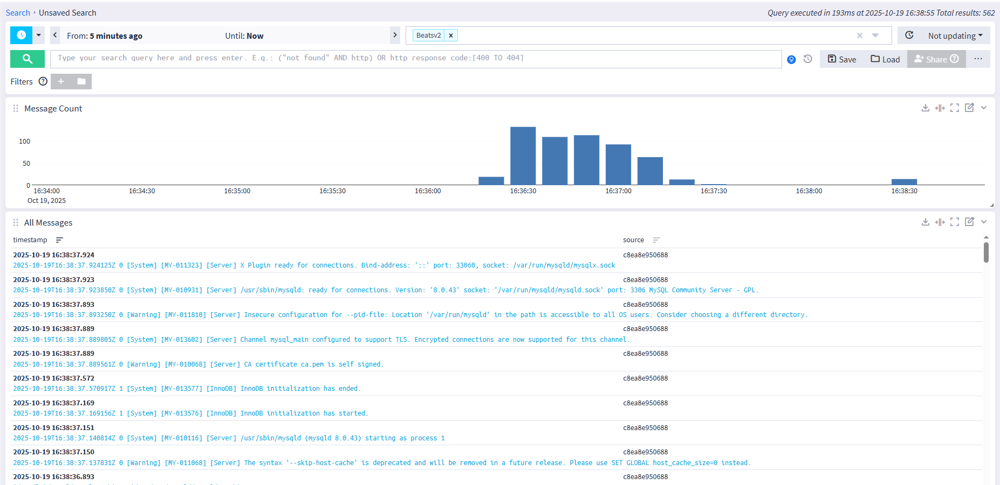

## Graylog

- graylog
- datanode
- mogodb
- graylog-sidecar
- filebeat

Graylog-sidecar запущен в контейнере, для общения с `filebeat` используется общий `docker volume` - `sidecar` , автоматически подкладываются сгенерированные конфигурации `filebeat` от `graylog`.

Запуск:
В `.env` указать:
```
GRAYLOG_PASSWORD_SECRET=""
GRAYLOG_TOKEN=""
GRAYLOG_ROOT_PASSWORD_SHA2=""
```

```shell
docker compose -f ../GAP-1/ghost-stack.yaml -p ghost up -d
docker compose up -d
```


