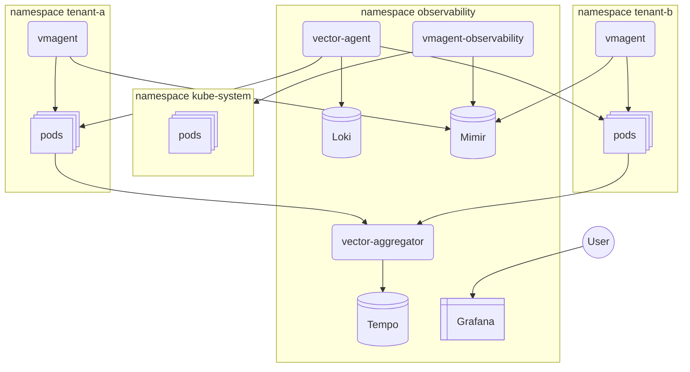

## Архитектура решения для multi-tenancy observability в Kubernetes



### Метрики:
 - VMagent
 - Mimir

Глобальные метрики кластера собираются через `VMagent`, который установлен через `victoria-metrics-k8s-stack` , метрики отсылаются в `Mimir` с id тенанта `infra`. У всех тенантов кластера есть возможность просматривать эти метрики. Если тенанту требуется отсылать метрики своего приложения, то дополнительно ставится в namespace [VMagent](./vmservicescrape.yaml) настроенный на отправку метрик с соответствующими tenant id (`X-Scope-OrgID`). `VMagent` для метрик кластера можно было заменить на Vector, но на данный момент установка header `X-Scope-OrgID`, который нужен для multitenancy [не поддерживается](https://github.com/Vectordotdev/Vector/pull/23962), но скорее всего будет добавлена в будущем.

### Логи:
 - Vector-agent
 - loki

Сбор и обработка логов происходит через `Vector`. Включение сбора логов на namespace тенанта происходит через label `logs.scrape: true`, id тенанта определяется также через label `tenant.name`. Каждый тенант может просматривать только свои логи.

### Трейсы:
 - Vector
 - Tempo

Тенантам достаточно указать правильную конечную точку отправки [OTEL трейсов](./tenant-workload.yaml) с правильным атрибутом `tenant.name`, далее `Vector` обработает трейс и отправит его в `Tempo` с аналогичным `X-Scope-OrgID`.
На данный момент Open Telemetry Collector [не поддерживает](https://github.com/open-telemetry/opentelemetry-collector-contrib/pull/41879) динамическую установку тенанта из атрибутов трейсов.

### Вывод

В будущем, скорее всего можно будет заменить `Vector` и `VMagent` на использование только `OpenTelemetry Collector`, так как он становится стандартом и в него добавят нужные [функции для multitenancy](https://github.com/open-telemetry/opentelemetry-collector-contrib/issues?q=state%3Aopen%20label%3Aextension%2Fheaderssetter) и полноценную [поддержку логов от Kubernetes](https://github.com/open-telemetry/opentelemetry-collector-contrib/issues/23339).


#### Разворачивание тестового стенда:
```shell
kind create cluster --config kind-cluster.yaml
kubectl use-context kind-observability
kubectl kustomize --enable-helm | kubectl apply --server-side --force-conflicts -f - # иногда требуется запустить 2 раза для правильного создания crd
python3 ./grafana-org.py # создаем тенантов, дашборды и источники данных в Grafana
# Login:Pass для Grafana - admin:admin
```

Приложения будут доступны по портам:

 - `8080` - Grafana
 - `8081` - tenant-a
 - `8082` - tenant-b
