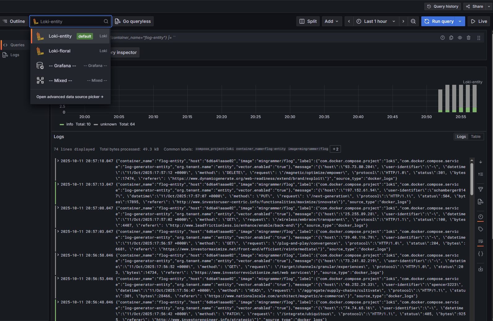

## Vector + Loki

Запуск:

```shell
docker compose up -d
```

Vector берет логи из Docker контейнеров и отсылает их в Loki, Loki запущен в Multitenant режиме, в качестве определителя тенанта используется `label` на docker контейнере `org.tenant.name`.
Дополнительно удаляются лишние поля из `json` тела лога.

### Loki

