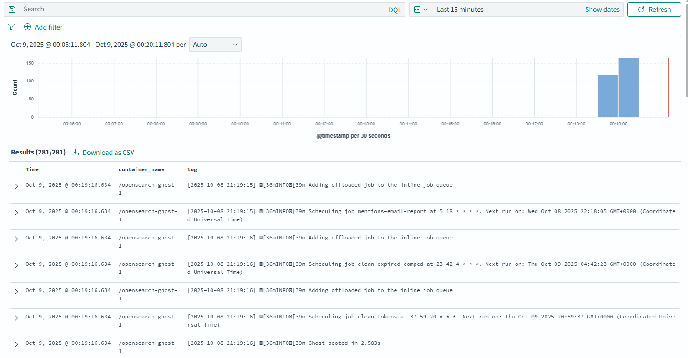

## Opensearch Stack

- fluent-bit
- data-prepper
- opensearch
- dashboards

Docker Logger Driver -> Fluentbit -> Dataprepper -> Opensearch


### Запуск

```shell
docker compose --env-file .env --env-file ../GAP-1/.env  up 
```

### Dashboard

