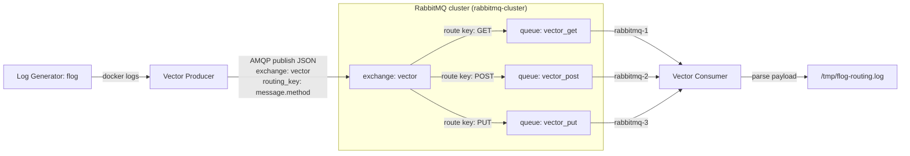

## Vector + RabbitMQ

Демонстрация работы RabbitMQ с Vector для обработки логов.

Запуск:

```shell
docker compose up -d
```

Веб панель кластера RabbitMQ будет на порту `15672`

## Схема взаимодействия


