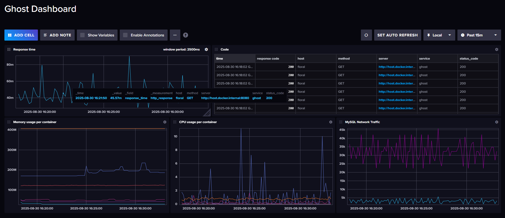

### Tick stack

- **t**elegraf
- **i**nfluxdb2
- **c**hronograf
- **k**apacitor

Так как Kapactior не поддерживает Stream Alerts для influxdbv2, решил реализовать алерты через нативный Flux в influxdb2.

Выставить в .env:

```
INFLUX_INIT_USERNAME=
INFLUX_INIT_PASSWORD=
INFLUX_INIT_ORG=
INFLUX_INIT_BUCKET=
INFLUX_INIT_RETENTION=
INFLUX_INIT_ADMIN_TOKEN=
GHOST_DB_USER=
MYSQL_ROOT_PASSWORD=
CHRONOGRAF_USER=
CHRONOGRAF_PASS=
TELEGRAM_BOT_TOKEN=
TELEGRAM_CHAT_ID=
```

Запуск: 
```
docker network create observability
docker compose -f tick-stack.yaml -p tick up -d
```

Отображение в Dashboard

