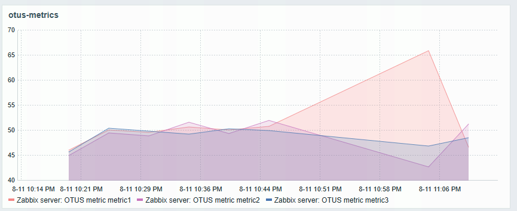

# Zabbix

В docker-compose содержится стек из сервисов zabbix:

  - postgresql
  - zabbix-server
  - zabbix-dasboard (UI)

### График



### Запуск

Выставить в .env

```
ZABBIX_DB_NAME=
ZABBIX_DB_USER=
ZABBIX_DB_PASSWORD=
ZABBIX_TIMEZONE=
```

```bash
docker network create zabbix-network
docker compose -p zabbix up
```